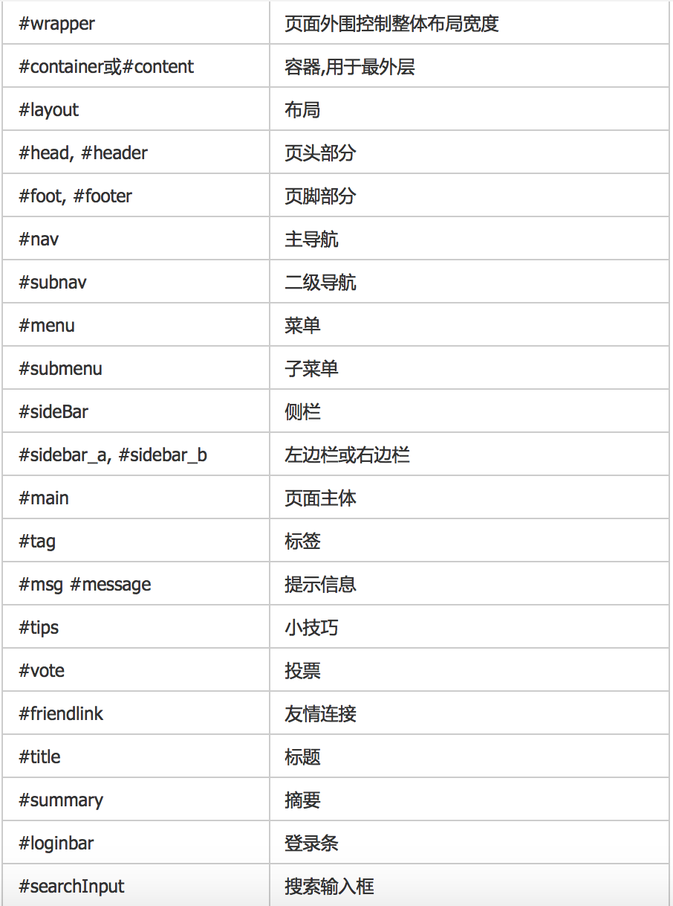
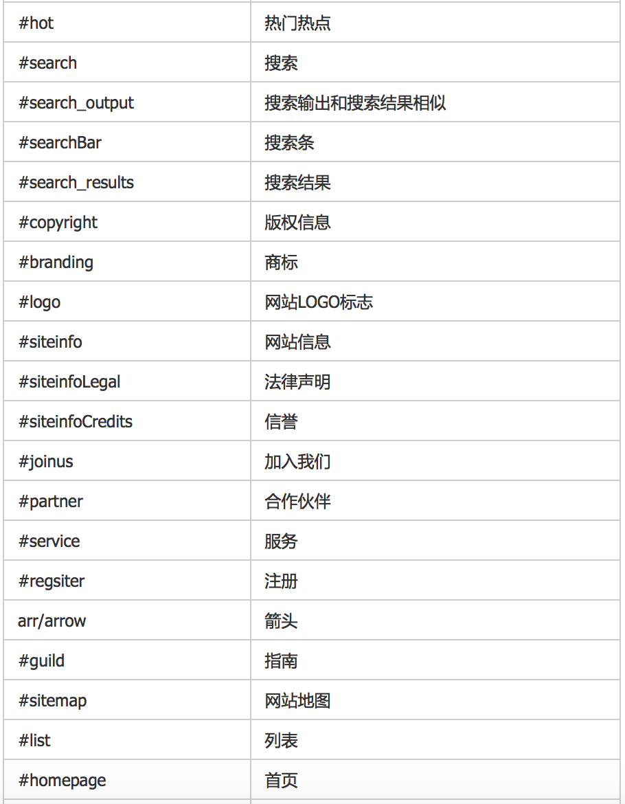
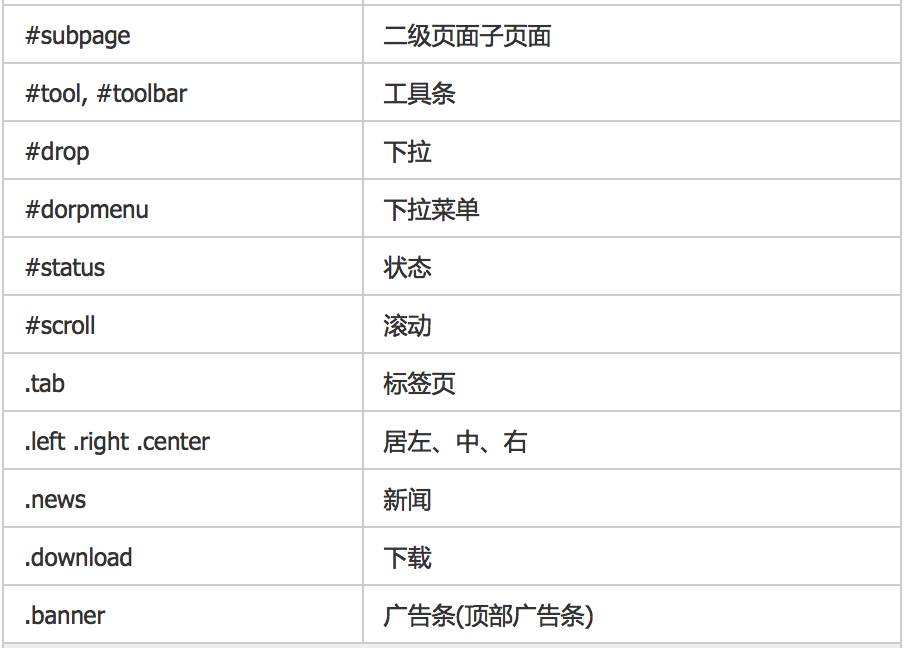
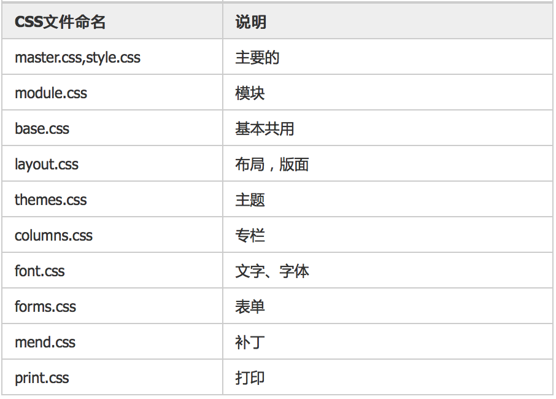

### CSS中的Class和ID命名规则
#### 1.命名规则说明
```
1.所有的命名最好都小写
2.属性的值一定要用双引号括起来，且一定要有值
3.每个标签都要有开始的结束，且要有正确的层次，排版有规律工整
4.空元素要有结束的tag或于开始的tag后加上"/"
5.表现与结构完全分离，代码中不涉及任何的表现元素，如style、font、bgColor、border等
6.<h1>到<h5>的定义，应遵循从大到小的原则，体现文档的结构，并有利于搜索引擎的查询。
7.给每一个表格和表单加上一个唯一的、结构标记id
8.给图片加上alt标签
9.尽量使用英文命名原则
10.尽量不缩写，除非一看就明白的单词
```

#### 2.相对网页外层重要部分CSS样式命名
```
1.外套 wrap ------------------用于最外层
2.头部 header ----------------用于头部
3.主要内容 main ------------用于主体内容（中部）
4.左侧 main-left -------------左侧布局
5.右侧 main-right -----------右侧布局
6.导航条 nav -----------------网页菜单导航条
7.内容 content ---------------用于网页中部主体
8.底部 footer -----------------用于底部
```

#### 3.命名参考表




